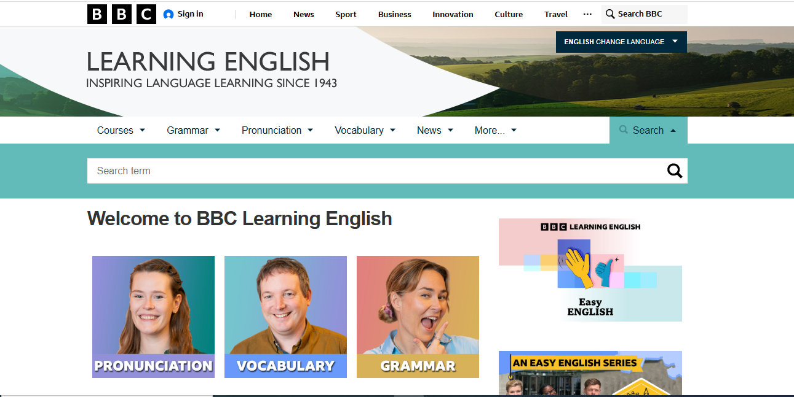

# 🌍 Learn English Online for Free
[](https://www.bbc.co.uk/learningenglish)

A Node.js-based application designed to help users like me learn English for free by providing easy access to lessons, grammar practice, vocabulary building, quizzes, and interactive tools. The system includes learning plans, progress tracking, and fun activities to improve reading, writing, listening, and speaking skills.

---

## 📚 Table of Contents

- [About](#about)
- [Features](#features)
- [Install](#install)
- [Usage](#usage)
- [Lessons](#lessons)
- [Practice](#practice)
- [Progress](#progress)
- [Contribute](#contribute)
- [License](#license)

---
## ℹ️ About

BBC Learning English is a free online platform by the BBC that offers lessons, videos, podcasts, and quizzes to help people worldwide improve their English skills.

---

## 🎯Features

 **Structured Learning Paths**  
  Courses tailored for beginners to advanced learners.

- **Multimedia Content**  
  Audio, video, and text materials to suit different learning styles.

- **Interactive Exercises**  
  Quizzes and activities to reinforce learning and track progress.

- **Real-World English**  
  Lessons based on current events and authentic materials.

- **Cultural Insights**  
  Learn idioms, expressions, and English-speaking cultures.

- **Podcasts & Dramas**  
  Audio series and stories to improve listening skills.

- **Business English**  
  Professional communication and workplace lessons.

- **Global Accessibility**  
  Available on web, podcasts, and social media platforms.

  ---
## 📥 Install

You can download the BBC Learning English app for free on Android devices from trusted app stores like Aptoide.

## 🚀 Installation step

Clone the project and install dependencies:

```bash
git clone https://github.com/your-username/learn-english-online.git
```
```bash
cd learn-english-online
```
```bash
npm start
```

## 🖼️ Screenshot



---
## 🔌 API Endpoints

| Method | Endpoint            | Description                       |
|--------|---------------------|-----------------------------------|
| GET    | /lessons            | Retrieve all lessons              |
| GET    | /lessons/:id        | Retrieve a specific lesson by ID  |
| POST   | /quizzes            | Submit quiz answers               |
| GET    | /progress/:userId   | Get progress for a specific user  |
| POST   | /users              | Create a new user account         |
| POST   | /auth/login         | Authenticate a user               |

---

## 🧠 Usage

1. Visit the [BBC Learning English website](https://www.bbc.co.uk/learningenglish) to access free English learning resources.  
2. Choose your skill level: beginner, intermediate, or advanced.  
3. Explore lessons in grammar, vocabulary, pronunciation, and real-world English.  
4. Use videos, podcasts, quizzes, and interactive exercises to practice.  
5. Track your learning progress over time.  
6. Access content anytime via web or mobile app for flexible learning.

---
## 📘 Lessons

- Grammar
- Pronunciation
- Vocabulary
- Real-World English
- Business English
- News English
- Podcasts & Dramas

---
## 📝 Practice

- 🧠 Grammar and vocabulary quizzes  
- 🎧 Listening practice with videos and audio  
- 🗣️ Speaking and pronunciation tips  
- ✍️ Writing tasks for real-life English  
- ✅ Self-check activities to test understanding

---
## 📈 Progress

- Track lesson completion and quiz results  
- View personalized feedback and improvement tips  
- Set and review daily learning goals

---
## 👥 Contributors


---
## 📄 License

All content and materials are © BBC and are protected by copyright laws.  
The resources are provided for personal, non-commercial use only.  

For permissions beyond this, please refer to the official [BBC Terms of Use](https://www.bbc.co.uk/usingthebbc/terms/) or contact the BBC directly.
